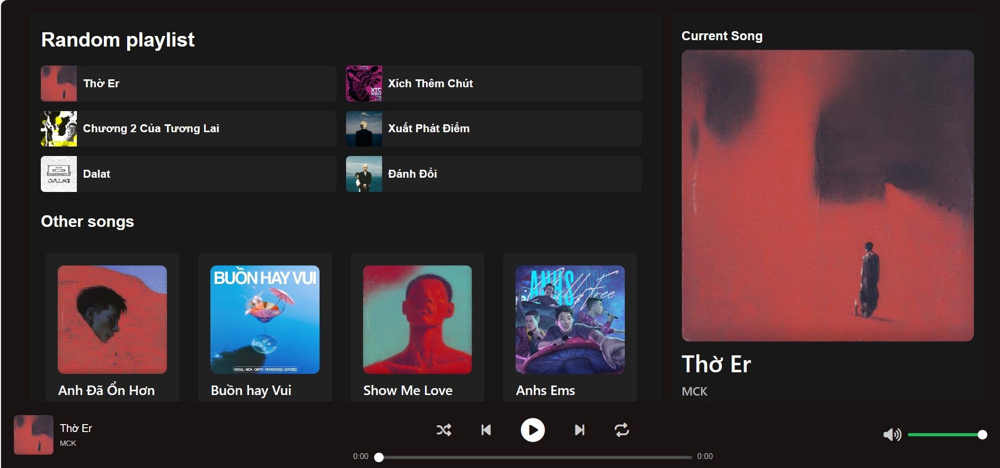

# MusicPlayer
## Description
A simple project using HTML, CSS and JS for playing music based on Spotify's UI

## Main Functions
<ul>
    <li>Play/Stop music</li>
    <li>Shuffle songs</li>
    <li>Change song's progress</li>
    <li>Next/Back</li>
    <li>Repeat</li>
    <li>Change Volume</li>
</ul>

## Overview

## Bugs
There are still some bugs that i have found solutions for them such as
<ul>
<li>Changing song's progress by dragging the bar instead of clicking make the background color go wrong.</li>
<li>Clicking on the first song of Random list when the web is loaded will not play that song</li>
I will try to fix them in the near future. Any suggestion will be appreciated!
 
You can try out the project here [Music Player]()
